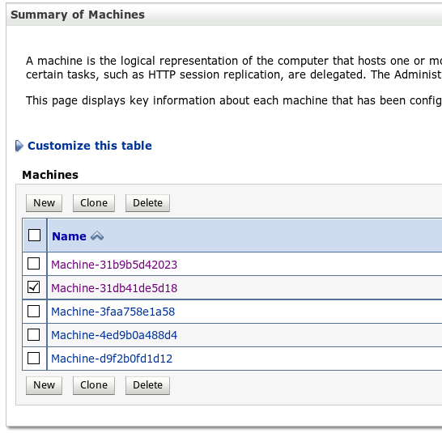

#Laboratory 3. Testing HA with Docker

## 3.1 Testing application. 
First check how coherence is replicating contacts between each URL.

** http://z1.renecloud.io:7101/example-web-app**
and 
** http://z1.renecloud.io:7102/example-web-app**

Put each one in each browser tab or in different Web Browser.

This an example application and is better rewrite URL than use a F5 refresh button or back button.

##3.2 Crashing one Managed Server
After you tested application we switch to our Console.

Check our docker instances running
```
# sudo docker ps
 CONTAINER ID        IMAGE                       COMMAND              CREATED             STATUS              PORTS                                                                NAMES
d9f2b0fd1d12        renecloud/weblogic-domain   "createMachine.sh"   8 hours ago         Up 8 hours          5556/tcp, 8001/tcp, 0.0.0.0:7202->7001/tcp, 0.0.0.0:7502->7574/tcp   c2
31b9b5d42023        renecloud/weblogic-domain   "createMachine.sh"   8 hours ago         Up 8 hours          5556/tcp, 8001/tcp, 0.0.0.0:7201->7001/tcp, 0.0.0.0:7501->7574/tcp   c1
4ed9b0a488d4        renecloud/weblogic-domain   "createServer.sh"    8 hours ago         Up 8 hours          5556/tcp, 8001/tcp, 0.0.0.0:7102->7001/tcp                           m2
31db41de5d18        renecloud/weblogic-domain   "createServer.sh"    8 hours ago         Up 8 hours          5556/tcp, 8001/tcp, 0.0.0.0:7101->7001/tcp                           m1
451e0aff40bf        renecloud/weblogic-domain   "startWebLogic.sh"   8 hours ago         Up 8 hours          5556/tcp, 7001/tcp, 0.0.0.0:8001->8001/tcp                           wlsadmin
```
Select one of Managed server and stop it.

```
# sudo docker stop 31db41de5d18
31db41de5d18
```
If you see on Weblogic Console this server crashed and we never can recovery. 


##3.2 Installing new one Managed Server

Now, we can start a new one with one simple command. However if we have to assing same docker id we clean instance history 
```
# sudo docker ps -a
CONTAINER ID        IMAGE                       COMMAND              CREATED             STATUS                       PORTS                                                                NAMES
d9f2b0fd1d12        renecloud/weblogic-domain   "createMachine.sh"   9 hours ago         Up 9 hours                   5556/tcp, 8001/tcp, 0.0.0.0:7202->7001/tcp, 0.0.0.0:7502->7574/tcp   c2
31b9b5d42023        renecloud/weblogic-domain   "createMachine.sh"   9 hours ago         Up 9 hours                   5556/tcp, 8001/tcp, 0.0.0.0:7201->7001/tcp, 0.0.0.0:7501->7574/tcp   c1
4ed9b0a488d4        renecloud/weblogic-domain   "createServer.sh"    9 hours ago         Up 9 hours                   5556/tcp, 8001/tcp, 0.0.0.0:7102->7001/tcp                           m2
31db41de5d18        renecloud/weblogic-domain   "createServer.sh"    9 hours ago         Exited (137) 5 minutes ago                                                                        m1
451e0aff40bf        renecloud/weblogic-domain   "startWebLogic.sh"   9 hours ago         Up 9 hours                   5556/tcp, 7001/tcp, 0.0.0.0:8001->8001/tcp                           wlsadmin

# sudo docker rm 31db41de5d18
```
So then creating other Managed Weblogic Server.
```
# sudo docker run --name m1 -d -p 7101:7001 --link wlsadmin:wlsadmin renecloud/weblogic-domain createServer.sh
3faa758e1a580b550c006cf36fcc1252d01d9f3e6ec94d63aa961f9b0a4a2a06
```
Looking into weblogic console, there is staring


Delete Managed Server died from cluster and delete his Machine associated.



Terrific!! Done!


